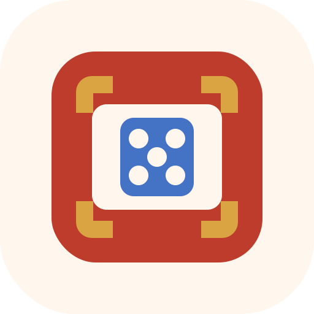

<div align="center">
  
  <h1>CC Orchestrator CLI Skill</h1>
  <p>Run Claude Code agent teams from the CLI with reproducible prompts, debug logs, and teammate-by-teammate reporting.</p>

  <p>
    
    
    
  </p>

  <p>
    <a href="./README.ja.md">日本語</a>
  </p>
</div>

## ✨ What It Does

This repository packages a root-level Codex skill for operating Claude Code in true agent-team mode from the CLI.

It is designed for the workflow we validated in this repo:

- ask Claude Code to create its own team instead of relying on `--agents`
- pass the task prompt over stdin
- enable `CLAUDE_CODE_EXPERIMENTAL_AGENT_TEAMS=1`
- capture a debug log
- confirm teammate spawn before claiming team mode worked
- require Claude Code to report what each teammate actually did

## 🚀 Quick Start

1. Make sure `claude` is available in your shell.
2. Read [SKILL.md](./SKILL.md) for the working rules.
3. Use the helper script with a prompt file or inline prompt text.

```powershell
.\scripts\run-claude-team.ps1 -PromptText @'
Create an agent team in this workspace and build a small static browser app.
- Spawn exactly 3 teammates yourself: coder, designer, reviewer.
- Report what each teammate actually did.
- Clean up the team when done.
'@ -Dangerous
```

The script prints a `DEBUG_PATH=...` line. Check that log for teammate activity such as `spawnInProcessTeammate`, `coder@`, `designer@`, and `reviewer@`.

## 🧭 Repository Layout

```text
.
|-- SKILL.md
|-- README.md
|-- README.ja.md
|-- LICENSE
|-- agents/
|   `-- openai.yaml
|-- assets/
|   `-- cc-orchestrator-cli-skill.svg
|-- references/
|   `-- prompt-patterns.md
|-- scripts/
|   |-- run-claude-team.ps1
|   `-- validate-skill.ps1
|-- examples/
|   `-- omikuji-app/
`-- .github/
    `-- workflows/
        `-- validate.yml
```

## 🛠️ Included Files

- [SKILL.md](./SKILL.md): the root skill definition and workflow guidance
- [agents/openai.yaml](./agents/openai.yaml): UI-facing skill metadata
- [references/prompt-patterns.md](./references/prompt-patterns.md): reusable prompt templates for build and review team runs
- [scripts/run-claude-team.ps1](./scripts/run-claude-team.ps1): PowerShell helper that enables team mode and stores a debug log
- [scripts/validate-skill.ps1](./scripts/validate-skill.ps1): repository validation script used by CI
- [examples/omikuji-app/](./examples/omikuji-app): sample generated app output kept as a reference artifact

## 🔍 Validation

Run the local validation script:

```powershell
.\scripts\validate-skill.ps1
```

GitHub Actions also runs the same checks through [validate.yml](./.github/workflows/validate.yml).

## 🧪 Verified Workflow

This repo was validated against real Claude Code runs in which Claude Code spawned teammates itself and produced debug-log evidence of team execution.

What we explicitly checked:

- the helper script returns Claude output and a debug log path
- the debug log shows `spawnInProcessTeammate`
- teammate names appear in the log
- the skill metadata and root skill file stay aligned

## ⚠️ Notes

- This repository assumes Claude Code is already installed and authenticated in your local environment.
- `--dangerously-skip-permissions` is intentionally optional and should only be used when hands-off execution is desired.
- This repository focuses on the CLI skill workflow itself, not on publishing a docs site.

## 📄 License

This repository is provided under the [MIT License](./LICENSE).
